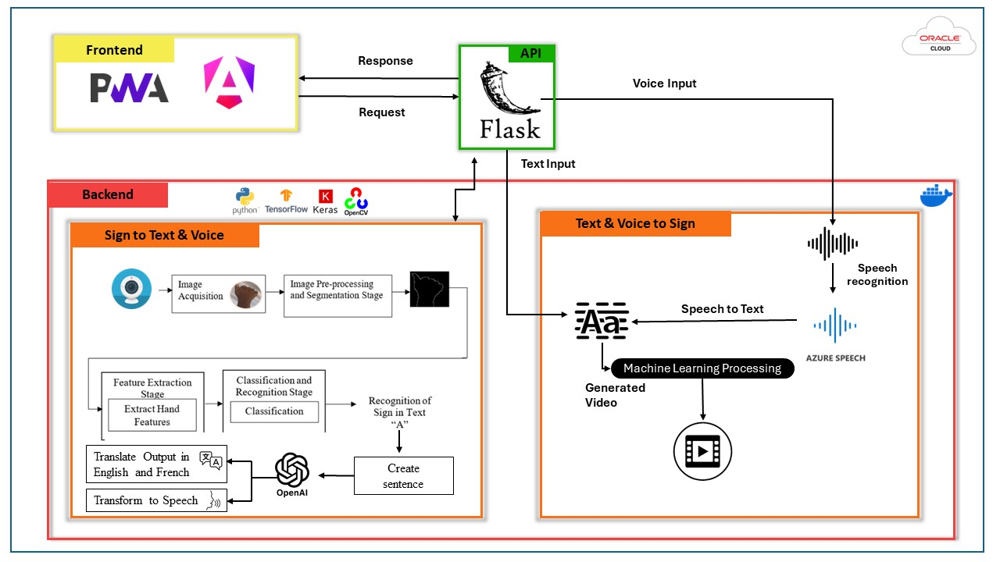

# EchoSign

EchoSign is a cross-platform application that translates Moroccan Sign Language (MSL) to text and speech, and vice versa. This project aims to bridge the communication gap between the hearing-impaired community and the general population by providing an accessible and efficient communication tool.

## Features

- **Sign Language to Text and Speech Translation**: Users can perform sign language gestures in front of their webcam, and the application will recognize and translate those gestures into text and speech output.
- **Text and Speech to Sign Language Translation**: Users can input text or voice, and the application will generate corresponding sign language gestures in the form of a video.
- **Multilingual Support**: The application supports translation of sign language gestures into Moroccan Darija, French, and English text and speech.
- **User-friendly Interface**: The application features a clean and intuitive user interface, making it easy for users to navigate and utilize its functionalities.

## Application Architecture

The application's architecture consists of three main components: Frontend, Backend, and External Services.

**Frontend**:
- Built using PWA (Progressive Web App) and Angular frameworks.
- Serves as the user interface for interacting with the application.
- Sends requests to the backend API (Flask) and receives responses for rendering the output.

**Backend**:
- Developed using Python, Flask, TensorFlow, Keras, and OpenCV.
- Divided into two main modules: "Sign to Text & Voice" and "Text & Voice to Sign."
- "Sign to Text & Voice" module handles image acquisition, preprocessing, feature extraction, classification, recognition, and translation of sign language gestures to text and speech.
- "Text & Voice to Sign" module converts text and voice input into corresponding sign language gestures.

**External Services**:
- API: Flask backend exposes an API for communication between the frontend and backend.
- Voice Input: Allows users to provide voice input, processed by the backend.
- Oracle Cloud: Represents an external cloud service for hosting the application.
- Azure Speech: Utilizes the Azure Speech Recognition service for converting voice input to text.

## Technologies Used

- **Frontend**: Angular, Tailwind CSS
- **Backend**: Python, Flask
- **Machine Learning**: TensorFlow, Keras, OpenCV
- **Speech Synthesis**: OpenAI API
- **Version Control and Collaboration**: GitHub

## Installation and Usage

1. Clone the repository: `git clone https://github.com/NouhaylaMouakkal/EchoSign.git`
2. Install the required dependencies (frontend and backend)
3. Start the frontend and backend servers
4. Access the application through your web browser

Detailed installation and usage instructions can be found in the project documentation.

## Contributing

Contributions to EchoSign are welcome! If you find any issues or have suggestions for improvements, please open an issue or submit a pull request. Make sure to follow the project's code of conduct.

## License

This project is licensed under the [MIT License](LICENSE).

## Controbutors : 
# Nouhayla MOUAKKAL - Zaid EL MOUADDIBE - Ayoub ADIL
